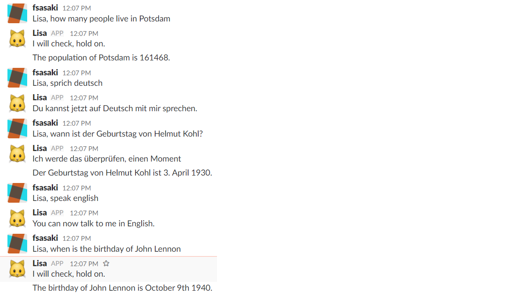

# Multillingual Chatbot for Wikipedia queries and slack integration

This repository contains a multilingual chatbot that can query Wikipedia and provide answers on slack. The bot can be asked in English or German and provide localized answers in both languages.

## Installation

You need 


- npm
- slack
- api.ai

to run the bot.

Download this repository. Add into the local repository folder a file accesstokens.js which looks as follows:

```
var accesstokens = {};
accesstokens.accessTokenAPIAI = {"en" : "accesstoken-for-english-agent", "de" : "accesstoken-for-german-agent"};
accesstokens.slackbottoken = "slackbot-token";
module.exports = accesstokens;
```

Start the bot locally with

```
npm start
```

This will add a bot to your slack channel which you can interact with as shown in the following screenshot.



## Installation in herkoku

Below is what you need to do to install the bot in the heroku cloud service.

write a Procfile file that has:

```
worker: node app.js
```

Follow description at https://devcenter.heroku.com/articles/deploying-nodejs to work with heroku, until "git add".

Before doing "git add", do heroku login and then heroku create. then do
heroku git:remote -a -name-of-your-app  (e.g. radiant-depths-56455)

Then do
```
git add .
git commit -am "some message"
git push heroku master
```

Follow on heroku these steps https://github.com/howdyai/botkit/issues/53#issuecomment-218850324 , so that no web process is started and that no port issue arises.
