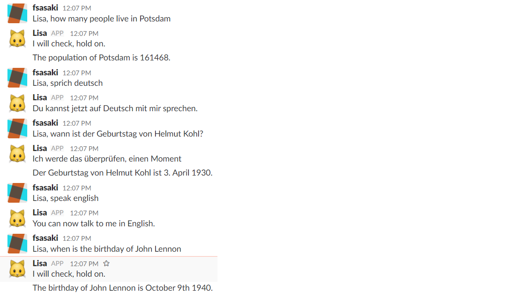
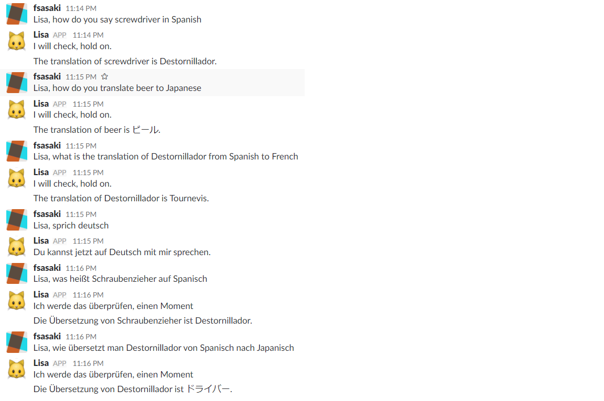

# Multillingual Chatbot for Wikipedia queries and slack integration

This repository contains a multilingual chatbot that can query Wikipedia and provide answers on slack. The bot can be asked in English or German and provide localized answers in both languages.

## General installation

You need


- node.js
- A slack account
- An api.ai account

to run the bot.

### Slack preparation


- Create a custom slack bot user, see documentation at https://api.slack.com/bot-users .
- In the integration settings of your bot, generate an API token. You will need that below.

### api.ai preparation

- Create two new agents called AskLinkedData (the English agent) and FrageLinkedData (the German agent)
- Upload the settings of these agents from https://github.com/fsasaki/myBot/tree/master/agents
- Both agents have an access token. You will need that below.

### Bot setup

Download this repository. Add into the local repository folder a file accesstokens.js which looks as follows:

```
var accesstokens = {};
accesstokens.accessTokenAPIAI = {"en" : "accesstoken-for-english-agent", "de" : "accesstoken-for-german-agent"};
accesstokens.slackbottoken = "slackbot-token";
module.exports = accesstokens;
```

## Use the bot

Start the bot locally with

```
npm start
```

This will add a bot to your slack channel which you can interact with as shown in the following screenshot.



The following example shows how to use the bot to get translations. The data source for this example is Wikidata.



## What can the bot do?

The bot can answer to the following type of questions:

* How many people live in (name of a city)? E.g., how many people live in Berlin?
* What is the birthday of (name of a person)? E.g., what is the birthday of John Lennon?
* Translate (a term) from (source language) into (target language). E.g., translate beer from English to Japanese.
* Define (an entity). E.g, define Sushi
* Tell me what you can do.
* Help!

The translation intent has some context handling. If the bot does not understand the target language, it will try to confirm it.

The bot is triggered by starting input with "Lisa, ". A question to the bot then can look as follows.

```
Lisa, how many people live in Berlin?
Lisa, what is the birthday of George Harrison?
Lisa, translate beer to Japanese.
Lisa, define George Harrison.
Lisa, help!
```

## Train intents

You can train the bot with example sentences. To do this, first trigger the intent with the question that the bot understands. See the list above for examples. Then, type "train intent:" followed by the training sentence, or for the German version "trainiere intent:". Everything after the column character ":" will be added to the training set for the intent. An example is given below.

```
Lisa, when is the birthday of Karl May?
I will check about the birthday of Karl May, hold on.
The birthday of Karl May is February 25th 1842.
Lisa, train intent: When was Karl May born?
I have changed an itent, see the intent name and the sentence added. What is the birthday of a person?, When was Karl May born?
```

To be able to do the intent training, node.js needs the developers token of api.ai. Add it to the  accesstokens.js file as follows.

```
accesstokens.accessTokenAPIAIdevelopers = {"en" : "developers token for English", "de" : "developers token for German"};
```

## Enlarge entities with Wikidata

Questions often contain entities, like "Karl May" in "when is the birthday of Karl May". You can use knowledge source like 
[Wikidata](https://www.wikidata.org/wiki/Wikidata:Main_Page) to fill your lists of entities. For example, we can get more than 20.000 labels for the entity "givenname", used in the forehand mentioned query. 

Gathering labels from Wikidata may lead to a query timeout. To avoid this, the SPARQL "offset" keyword can be helpful. See an exampe at 
[http://tinyurl.com/y8hfgewl](http://tinyurl.com/y8hfgewl) (thanks to 

[WikidataFacts](https://twitter.com/WikidataFacts/status/1071824319507062786) for the suggestion).

## Installation in herkoku

Below is what you need to do to install the bot in the heroku cloud service.

write a Procfile file that has:

```
worker: node app.js
```

Follow description at https://devcenter.heroku.com/articles/deploying-nodejs to work with heroku, until "git add".

Before doing "git add", do heroku login and then heroku create. then do
heroku git:remote -a -name-of-your-app  (e.g. radiant-depths-56455)

Then do
```
git add .
git commit -am "some message"
git push heroku master
```

Follow on heroku these steps https://github.com/howdyai/botkit/issues/53#issuecomment-218850324 , so that no web process is started and that no port issue arises.
